# Báo cáo cho nhiệm vụ: Đăng kí và đăng nhập có xác thực gương mặt với NestJS - TypeScript và FastAPI Model Facenet - Python.
## 1. Tổng quan
- Nhiệm vụ này thực hiện nhằm xây dựng một hệ thống xác nhận người dùng bằng gương mặt đơn giản gồm 3 thành phần chính:
    - **Backend:** Cung cấp API để quản lý user (đăng nhập và đăng kí bằng email, mật khẩu), xác thực bằng JWT, xử lý dữ liệu khuôn mặt và upload ảnh, lưu trữ để phục vụ đăng nhập có xác thực gương mặt. BE viết bằng NestJS + database MongoDB.
    - **Frontend:** Giao diện web để người dùng đăng ký tài khoản, đăng nhập, đăng ký khuôn mặt và xác thực bằng camera. FE viết bằng Next.js/React, có sự kết hợp để viết FE cho moblie bằng React Native.
    - **Face Recognition Model:** Mô hình deep learning FaceNet để sinh vector đặc trưng (embedding) từ ảnh khuôn mặt và so khớp nhận diện. Sử dụng confidence score và similiar score để làm tiêu chuẩn xác thực.

*Hệ thống hướng tới việc thử nghiệm thay thể bổ sung cho cơ chế đăng nhập truyền thống khi có thêm gương mặt sẽ nâng cao tính thuận tiện và an toàn.* 

2. Luồng hoạt động tổng quát.

    (a) **Đăng kí tài khoản** 

    1. Người dùng nhập email, mật khẩu, họ tên trên FE. Nếu trống, trùng email... thì thông báo.
    2. Hợp lệ thì FE gọi API ```/users/register``` để BE lưu thông tin vào database collection ```users``` (dùng bcrypt để hash mật khẩu).
    3. BE trả về kết quả đăng ký thành công thì FE chuyển sang bước đăng nhập.

    (b) **Đăng nhập**
    1. User nhập email và mật khẩu vào FE.
    2. Nếu hợp lệ. FE gọi API ```/users/login```.
    3. BE kiểm tra mật khẩu:
        - Nếu sai thì trả thông điệp.
        - Nếu đúng thì sinh JWT token và kiểm tra user đã có khuôn mặt chưa.
        - BE trả về  ```step```:
            - ```"face_register_required"```: user chưa đăng ký gương mặt, chuyển tới bước đăng ký khuôn mặt.
            - ```"face_verify_required"```: user đã có gương mặt, chuyển qua yêu cầu xác thực bằng khuôn mặt.

    (c) **Đăng kí gương mặt**
    1. User mở camera, FE chụp ảnh và gửi lên API ```/faces/register```.
    2. BE nhận ảnh sau đó gọi Model AI để chọn embedding khuôn mặt ổn nhất.
    3. Lưu ảnh vào thư mục để sau dùng cho việc xác thực. Có kiểm tra ảnh bị đen, không có gương mặt vân vân.
    4. Dùng userId từ bước đăng nhập nhờ JWT token để làm thứ xác định mặt hay ảnh đó là của user nào. Đường dẫn tới ảnh được lưu một trường trong collection ```faces```.

    (d) **Xác thực gương mặt**
    1. FE mở camera, gửi ảnh mới lên API ```/faces/verify```.
    2. BE dùng Model AI sinh embedding từ ảnh mới, so sánh với embedding ảnh đã lưu đường dẫn trong DB.
    3. Nếu khoảng cách nhỏ hơn ngưỡng quy định thì xác thực thành công, user được truy cập hệ thống.
    4. Nếu không khớp thì BE trả lỗi xác thực.

    (e) **Truy cập và xác thực**

    1. Khi user đã đăng nhập thành công (qua cả mật khẩu + face), FE lưu JWT token vào local storage.
    2. Tất cả API sau này sẽ kèm token trong header Authorization.
    3. BE kiểm tra token bằng ```jwt-auth.guard.ts``` trước khi cho phép truy cập.

## 2. Backend (NestJS + MongoDb)

2.1 Users Schema (```users.schema.ts```)

- Sử dụng Mongoose để định nghĩa document ```User```.
- Các trường:
    - ```email```: Bắt buộc và độc nhất, đảm bảo không có 2 tài khoản trùng email.
    - ```passwordHash```: bắt buộc, lưu password đã hash bằng ```bcrypt```.
    - ```fullName```: bắt buộc phải có.
- Có thêm ```timestamps: true``` để tự động thêm ```createdAt```,```updatedAt```. Phục vụ cho mục đích sau.
- ```UserDocument```: kiểu kết hợp giữa ```User``` và ```mongoose.Document``` với ```_id: string```, thuận tiện khi làm việc với dữ liệu.

2.2 Users DTO (```user.dto.ts```)
- Sử dụng class-validator để validate input từ client.
- LoginUserDto:
    - ```email```: phải đúng format email.
    - ```password```: không được rỗng.
- RegisterUserDto: 
    - ```email```: định dạng hợp lệ.
    - ```password```: không rỗng.
    - ```fullName```: không rỗng.

2.3 Users Service (users.service.ts)
- ```Injectable service```, kết nối DB bằng @InjectModel.
- Kết hợp với ```AuthService``` và ```FaceModel``` để xử lý logic.
- Các chức năng chính:

    2.3.1 ```register(email, password, fullName)```

    - Hash password bằng ```bcrypt```.

    - Tạo user mới.

    - Xử lý lỗi ```11000``` (duplicate email) sẽ trả về ```BadRequestException("Email đã được đăng ký trước đó")```

    2.3.2 ```login(email, password)```

    - Tìm user theo email.

    - So sánh password với hash bằng ```bcrypt.compare```.

    - Nếu sai ném ```UnauthorizedException("Email hoặc mật khẩu không chính xác")```.
    - Nếu đúng:
        - Sinh JWT qua ```AuthService```.
        - Kiểm tra user đã có face trong ```FaceModel``` chưa.
        - Trả về ``{id, email, fullName, accessToken, step}`` với ```step``` báo cho frontend biết:
            - ```"face_verify_required"```: đã có dữ liệu face chuyển qua xác thực.
            - ```"face_register_required"```: chưa có dữ liệu face chuyển qua đăng ký khuôn mặt.

2.4 Users Controller (users.controller.ts)
- Định nghĩa API ```users/```.
- ```POST /users/register```:
    - Nhận ```RegisterUserDto```.
    - Gọi service ```register```.
    - Trả về ```{id, email, fullName}``` (không trả password).
- ```POST /users/login```:
    - Nhận ```LoginUserDto```.
    - Gọi service ```login```.
    - Trả về ```{userId, step, accessToken}```.
    - Nếu lỗi thì trả ```BadRequestException(e.message)```.

2.5 Faces Schema (`face.schema.ts`)

- Sử dụng Mongoose để định nghĩa document `Face`.
- Các trường:
  - `userId`: kiểu `ObjectId`, tham chiếu tới document `User`, bắt buộc.
  - `refFile`: tên file ảnh gốc đã lưu, bắt buộc.
  - `similarity`: số thực, mặc định `null`, lưu độ tương đồng khi xác thực.
  - `confidence`: số thực, mặc định `null`, lưu độ tin cậy khi xác thực.
- Có thêm `timestamps: true` để tự động thêm `createdAt`, `updatedAt`.
- `FaceDocument`: kiểu kết hợp giữa `Face` và `mongoose.Document` với `_id: string`.

2.6 Faces Service (`face.service.ts`)

- `Injectable service`, kết nối DB bằng `@InjectModel`.
- Kết hợp với `ConfigService` để gọi ML service qua HTTP.
- Các chức năng chính:

  2.6.1 `isBlackImage(filePath: string)`

  - Đọc ảnh bằng `Jimp`.
  - Quét toàn bộ pixel, tính giá trị trung bình kênh màu.
  - Nếu ảnh quá tối (avg < 5) thì trả về `true`.

  2.6.2 `register(userId, refFile)`

  - Tạo document `Face` mới với `userId` và `refFile`.
  - Lưu vào DB.

  2.6.3 `verify(userId, frames)`

  - Tìm `Face` mới nhất của user trong DB.
  - Nếu không có `refFile`, trả lỗi 404.
  - Tạo `FormData` gồm `ref_path` và các frame ảnh từ FE (base64 → buffer).
  - Gọi ML service endpoint `/extract_batch`.
  - Nếu ML service trả lỗi thì báo `success=false`.
  - Nếu thành công:
    - Lấy `similarity` và `confidence` từ kết quả.
    - Cập nhật vào DB cho Face.
    - Trả về object `{success, similarity, confidence, framesUsed}`.
    - `success` là `true` nếu `similarity > 0.7`.

2.7 Faces Controller (`face.controller.ts`)

- Định nghĩa API `faces/`.
- Có gắn `JwtAuthGuard` để yêu cầu JWT token.

- `POST /faces/register`:
  - Dùng `FilesInterceptor` để upload nhiều ảnh (tối đa 10).
  - Gửi ảnh qua ML service (`/select_best_frame`).
  - ML trả về index frame tốt nhất (`bestIdx`) và confidence.
  - Xoá các file không được chọn, giữ lại file tốt nhất.
  - Kiểm tra ảnh không rỗng (`fs.statSync`) và không quá tối (`isBlackImage`).
  - Gọi `faceService.register` để lưu vào DB.
  - Trả về `{id, userId, refFile, confidence}`.

- `POST /faces/verify-login`:
  - Nhận danh sách frames (base64) từ body.
  - Gọi `faceService.verify` để gửi sang ML service `/extract_batch`.
  - So sánh kết quả với ngưỡng:
    - Nếu `similarity < 0.7` thì thất bại (khuôn mặt không khớp).
    - Nếu `confidence < 0.7` thì thất bại (độ tin cậy thấp).
    - Nếu đạt yêu cầu thành công, trả về `{success, userId, msg, similarity, confidence}`.

2.8 Auth Service (`auth.service.ts`)

- `Injectable service`, cung cấp chức năng tạo JWT.
- Sử dụng `JwtService` từ `@nestjs/jwt`.
- Chức năng chính:

  2.8.1 `generateToken(user)`

  - Nhận vào `{id, email}`.
  - Tạo payload với `sub = id`, `email`.
  - Gọi `this.jwtService.sign(payload)` để sinh JWT.
  - Token mặc định có `expiresIn = 1h` (theo config trong `AuthModule`).

2.9 JWT Strategy (`auth.strategy.ts`)

- Kế thừa `PassportStrategy(Strategy)` từ `passport-jwt`.
- Cấu hình:
  - Lấy token từ header `Authorization: Bearer <token>`.
  - Không bỏ qua expiration (`ignoreExpiration: false`).
  - Dùng secret từ biến môi trường `JWT_SECRET`.
- Hàm `validate(payload)`:
  - Trả về `{userId: payload.sub, email: payload.email}`.
  - Thông tin này sẽ được gắn vào `req.user`.

2.10 JWT Auth Guard (`jwt-auth.guard.ts`)

- Kế thừa `AuthGuard('jwt')` từ `@nestjs/passport`.
- Được sử dụng để bảo vệ các route yêu cầu xác thực.
- Nếu JWT hợp lệ thì cho phép request đi tiếp, ngược lại trả về 401.

2.11 Auth Module (`auth.module.ts`)

- Import `PassportModule` và `JwtModule`.
- `JwtModule` được cấu hình async:
  - Lấy `secret` từ `ConfigService` (`JWT_SECRET`).
  - Token có thời hạn 1h.
- Providers:
  - `AuthService`: sinh token.
  - `JwtStrategy`: xác thực token.
- Export `AuthService` để các module khác (như `UsersService`) có thể dùng.

2.12 Files Controller (`files-uploads.controller.ts`)

- Định nghĩa API `files/`.
- Sử dụng `JwtAuthGuard` để bảo vệ route.
- `GET /files/:filename`:
  - Nhận tên file từ `param`.
  - Tạo đường dẫn đầy đủ trong thư mục `PRIVATE_UPLOADS`.
  - Nếu file không tồn tại thì trả 404.
  - Nếu tồn tại thì trả file trực tiếp bằng `res.sendFile`.

2.13 Multer Config (`multer.config.ts`)

- Sử dụng `multer` với `diskStorage` để lưu file.
- Cấu hình:
  - `destination`: thư mục đích là `PRIVATE_UPLOADS` (theo biến môi trường `UPLOADS_DIR`, mặc định `"uploads"`).
  - `filename`: đặt tên file duy nhất bằng `uuid` + đuôi gốc (`extname`).
- `PRIVATE_UPLOADS`: được export để các module khác có thể dùng chung.

2.14 App Module (`app.module.ts`)

- Module gốc của ứng dụng NestJS.
- Import:
  - `ConfigModule` để load biến môi trường.
  - `MongooseModule.forRootAsync` để kết nối MongoDB (URI lấy từ `MONGO_URI`).
  - `MongooseModule.forFeature` để đăng ký schema `User` và `Face`.
  - `AuthModule`.
- Controllers: `UserController`, `FaceController`, `FilesController`.
- Providers: `UserService`, `FaceService`.

2.15 Main Entry (`main.ts`)

- Hàm `bootstrap()` khởi tạo ứng dụng NestJS.
- Cấu hình:
  - Enable CORS (nguồn lấy từ biến môi trường `CORS_ORIGIN`).
  - Cho phép request body lớn (`limit: 50mb`).
  - Gắn `ValidationPipe` toàn cục để validate DTO.
- Lắng nghe trên port lấy từ biến môi trường `PORT`.
- Log `"Backend is running"` khi server đã khởi động.

*Dùng .env để chứa dẫn tới database hay port, khi thử dùng trycloudfare để tạo tunnel.*

## 3. Frontend (NextJS)

3.1 `face-login/`
- Trang xác thực gương mặt sau khi backend yêu cầu `step = face_verify_required`.
- Kiểm tra trong mỗi frame có khuôn mặt hợp lệ hay không bằng `tinyFaceDetector`.
- Mở webcam, thu 5 khung hình bằng **face-api.js**.
- Gửi các frame qua API `/faces/verify-login` kèm JWT token.
- Nếu backend xác thực thành công thì điều hướng sang `home`, nếu thất bại thì hiển thị thông báo lỗi.

3.2 `face-register/`
- Giao diện đăng ký gương mặt cho user mới (khi backend trả về `step = face_register_required`).
- Mở camera, chụp 5 ảnh liên tiếp bằng **face-api.js**,không hiển thị landmarks nhưng lưu vẫn có để sử dụng.
- Gửi ảnh qua API `/faces/register` dưới dạng `FormData` kèm JWT token.
- Sau khi đăng ký thành công, frontend chuyển hướng sang `face-login` để xác thực.
- Sử dụng AI  tích hợp FE theo mô tả công việc để lấy landmark. 

3.3 `login/`
- Trang đăng nhập cơ bản bằng email + mật khẩu.
- Gọi API `/users/login`, backend trả về JWT token và thông tin `step`.
- FE lưu token vào `localStorage`.
- Dựa theo `step`:
  - Nếu `face_register_required` thì chuyển sang `face-register`.
  - Nếu `face_verify_required` thì chuyển sang `face-login`.

3.4 `page.tsx`
- Entry chính của ứng dụng, phục vụ đăng ký tài khoản.
- Có input `fullName`, `email`, `password`.
- Gửi dữ liệu qua API `/users/register`.
- Nếu thành công thì chuyển sang `login`, nếu lỗi thì hiển thị thông báo.

3.5 `home/`
- Trang chính sau khi user đã login và xác thực gương mặt thành công.
- Hiển thị thông tin giới thiệu dự án, mô tả luồng hoạt động.
- Trang này được bảo vệ, chỉ truy cập khi có JWT token hợp lệ.

3.6 `layout.tsx`
- Định nghĩa layout chung cho toàn bộ ứng dụng.
- Gồm header, styles và bố cục.
- Giúp tái sử dụng giao diện và giữ trải nghiệm thống nhất.

## 4. Model (FastAPI + PyTorch)

4.1 Môi trường & Thư viện
- Sử dụng **FastAPI** để xây dựng API phục vụ nhận diện khuôn mặt.
- Thư viện chính:  
  - `facenet-pytorch` với **MTCNN** để phát hiện khuôn mặt và **InceptionResnetV1** để trích xuất embedding.  
  - `torch` + `torchvision` cho xử lý deep learning.  
  - `opencv-python`, `Pillow`, `numpy` cho xử lý ảnh.  
  - `uvicorn` để chạy server.  
- Model chạy được trên cả **GPU (CUDA)** và **CPU**, **CPU** sẽ chậm hơn, xác định qua `torch.cuda.is_available()`.

4.2 Thành phần chính
- **MTCNN**: phát hiện khuôn mặt trong ảnh, có thể trả về landmarks và xác suất phát hiện (`prob`).  
- **InceptionResnetV1** (pretrained `vggface2`): sinh vector đặc trưng (embedding) cho khuôn mặt.  
- **sim_to_conf()**: hàm chuyển độ tương đồng cosine thành xác suất tin cậy (confidence) bằng logistic.  

4.3 API chính

4.3.1 `/extract_batch`
- Input:  
  - `ref_path`: đường dẫn ảnh tham chiếu đã lưu trước đó.  
  - `files`: danh sách ảnh (frames) upload từ FE.  
- Xử lý:  
  - Đọc ảnh tham chiếu, trích xuất embedding chuẩn hoá.  
  - Duyệt qua các frame, phát hiện face bằng **MTCNN**, tính embedding bằng **ResNet**.  
  - Trung bình embedding từ các frame hợp lệ, chuẩn hoá vector.  
  - Tính độ tương đồng cosine giữa embedding trung bình và embedding tham chiếu.  
  - Trả về số frame hợp lệ, similarity và confidence.  
- Vai trò: **so khớp khuôn mặt login với khuôn mặt đã đăng ký**.

4.3.2 `/select_best_frame`
- Input: danh sách ảnh (frames).  
- Xử lý:  
  - Với mỗi frame, phát hiện khuôn mặt bằng **MTCNN**.  
  - Chọn frame có xác suất phát hiện (`prob`) cao nhất.  
- Output: chỉ số frame tốt nhất và confidence.  
- Vai trò: **chọn frame gốc chất lượng nhất để lưu làm dữ liệu tham chiếu**.

4.4 Tích hợp với hệ thống
- Khi **FE gửi ảnh** (từ `face-register` hoặc `face-login`), backend sẽ gọi API của service này.  
- `/select_best_frame` dùng trong quá trình **đăng ký khuôn mặt** để lấy ảnh tốt nhất làm ảnh chuẩn.  
- `/extract_batch` dùng trong quá trình **xác thực** để so sánh embedding giữa ảnh login và ảnh chuẩn.  
- Nhờ FastAPI + CORS, model server có thể giao tiếp trực tiếp với **Next.js FE** và **NestJS BE**.

4.5 Kết quả
- Model hoạt động ổn định, có thể phát hiện và nhận diện gương mặt trên ảnh webcam.  
- Đưa ra kết quả với similarity (cosine) và confidence (0–1) rõ ràng.  
- Đảm bảo tốc độ xử lý hợp lý nhờ MTCNN (phát hiện nhanh) và InceptionResnetV1 (nhận diện chính xác).  
- Nhược điểm: chưa có liveness. khi bị Fake bởi ảnh tĩnh và streaming vẫn bị lọt qua.
## 5. Bài học và hướng phát triển.

5.1 Bài học rút ra
- **Kiến trúc tách biệt**: Chia hệ thống thành 3 phần (BE, FE, Model) giúp dễ phát triển, bảo trì và thay thế từng thành phần mà không ảnh hưởng toàn hệ thống.  
- **Quy trình xác thực nhiều bước**: Kết hợp đăng nhập (email + mật khẩu) với xác thực gương mặt giúp tăng độ an toàn.   
- **Tích hợp ML vào hệ thống thực tế**: Sử dụng FastAPI + PyTorch để wrap model thành API cho thấy mô hình AI có thể được triển khai như một service độc lập, dễ mở rộng.  
- **Bảo mật token**: Lưu JWT trong `localStorage` hoạt động được, nhưng vẫn cần cân nhắc bảo mật.

5.2 Hướng phát triển
- **Cải thiện model**:  
  - Dùng các model nhẹ hơn (MobileFaceNet, ArcFace) để tăng tốc độ. Cai thiện liveness tránh fake để xác thực. Liveness và anti proofing là vô cùng quan trọng.
- **Nâng cao trải nghiệm người dùng**:  
  - Thêm feedback trực quan khi FE chưa phát hiện được khuôn mặt (ví dụ: khung viền màu đỏ/xanh).  
  - Cho phép chụp nhiều lần nếu chất lượng ảnh kém.

## 6. Sơ đồ trực quan.

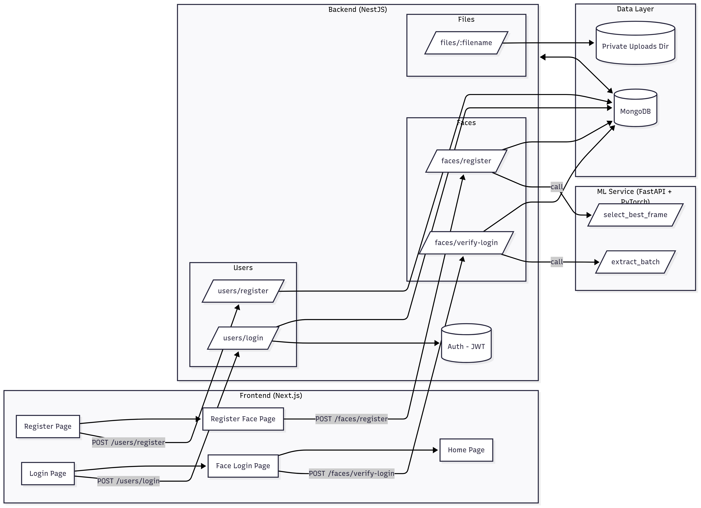

## 7. Sử dụng trực tiếp.

7.1 Đăng kí với email và mật khẩu.

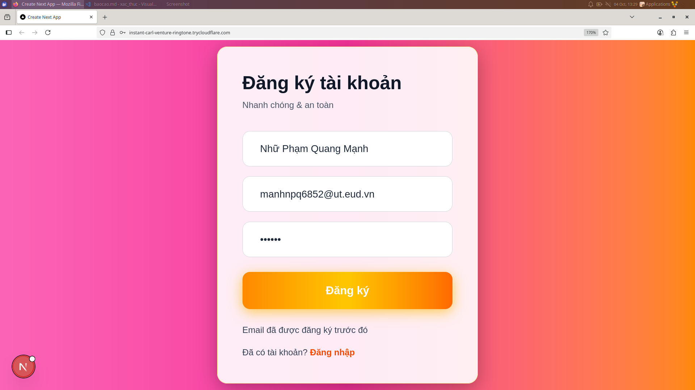

7.2 Đăng nhập

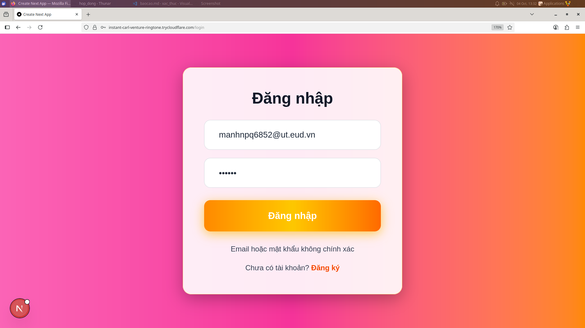

7.3 Đăng kí gương mặt

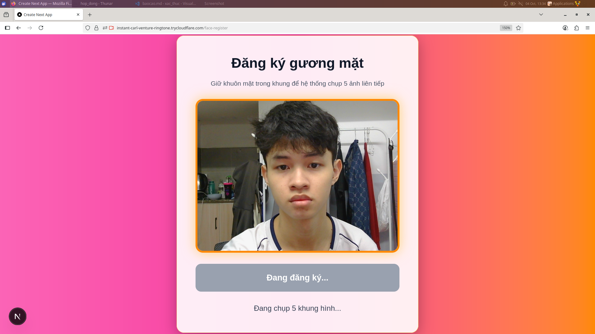

7.4 Xác thực gương mặt và home page

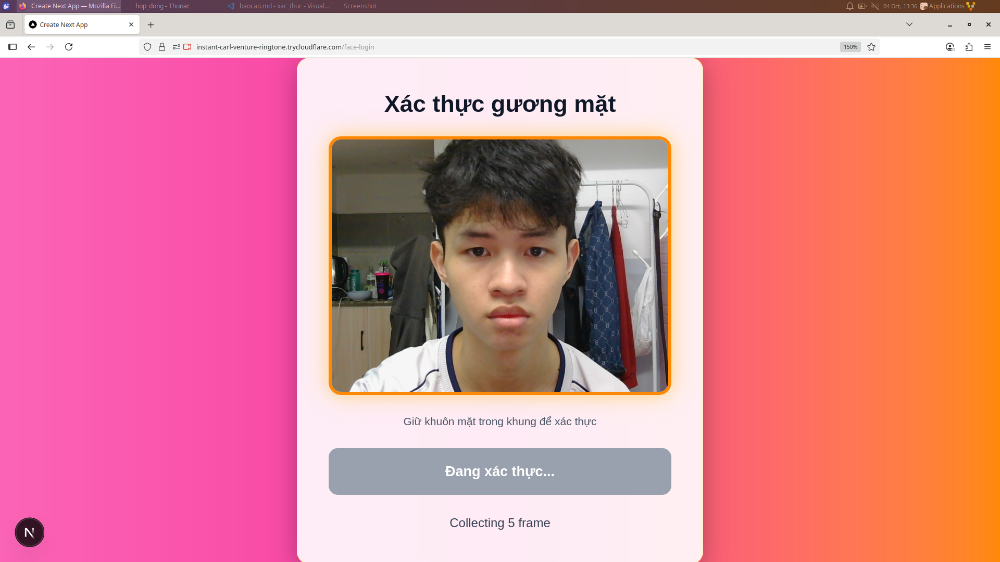

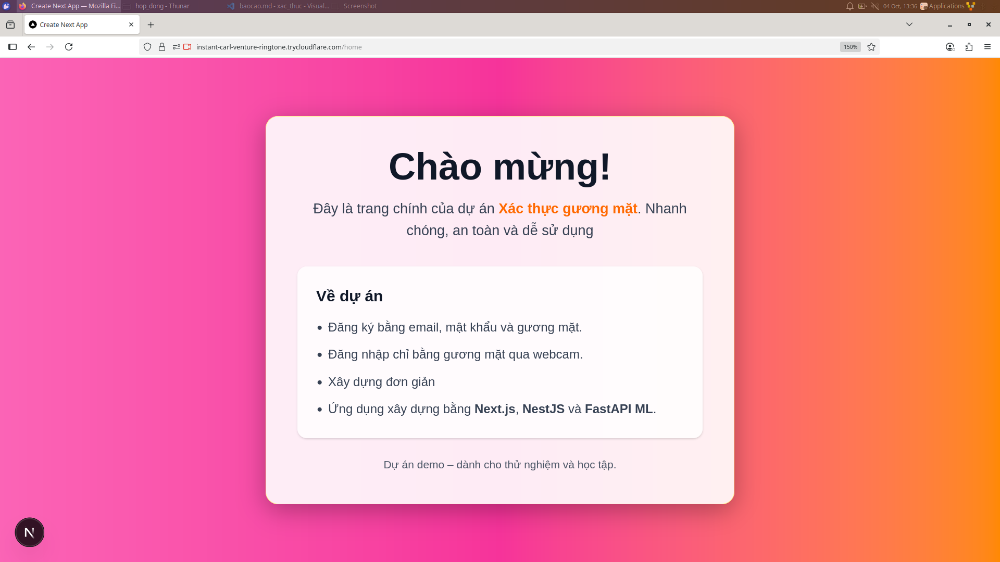

7.5 Một số hình ảnh thử nghiệm

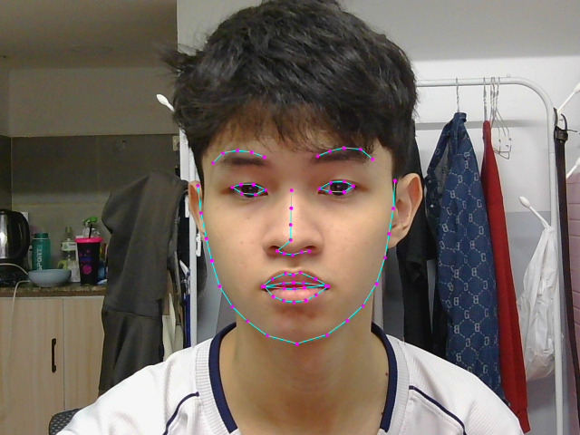

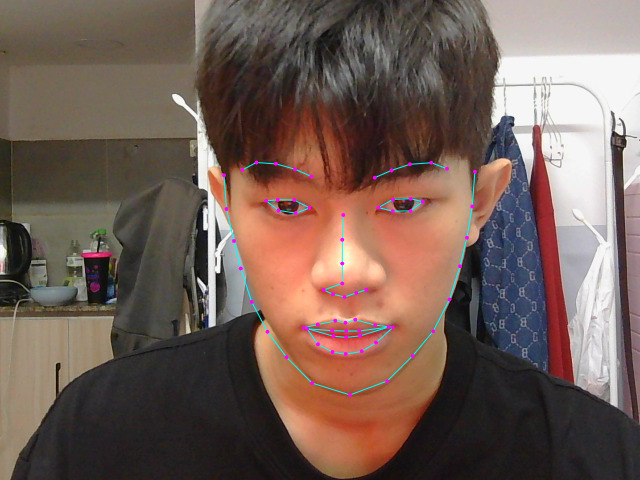

- Nếu gương mặt không đúng ngay lập tức báo ra không khớp. Các tính huống để trống hay nhập trùng email, sai mật khẩu đều được log ra để người dùng quan sát.

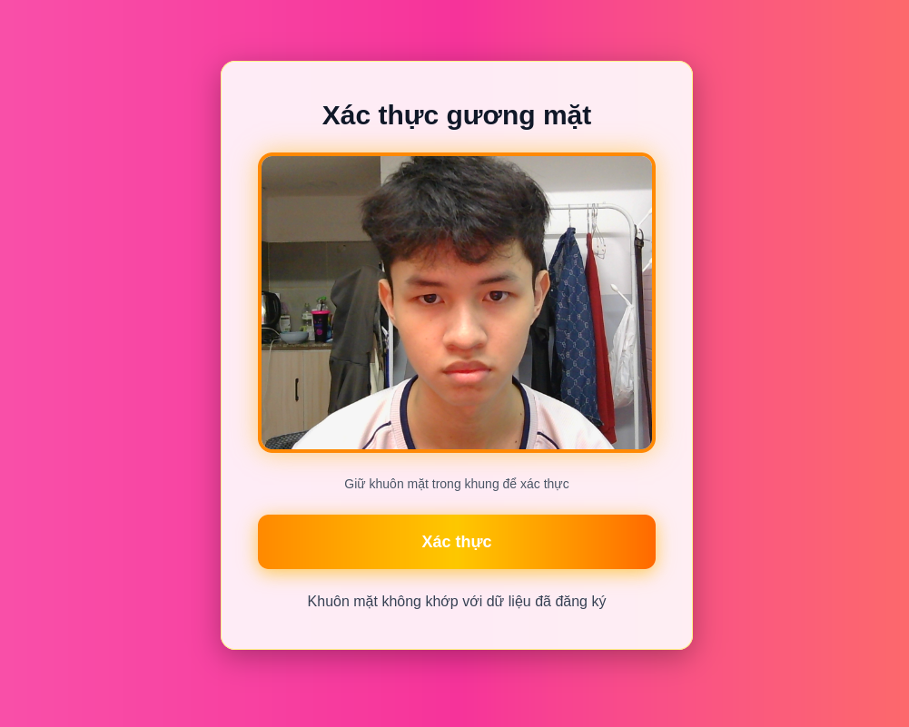

7.6 Một vài hình ảnh về database và log

- Database MongoDb tên `test` gồm hai collection là `users` và `faces`.
- Gồm các trường yêu cầu tên, đường dẫn ảnh, email, mật khẩu, điểm tự tin và các trường bổ sung.
- `users`:

    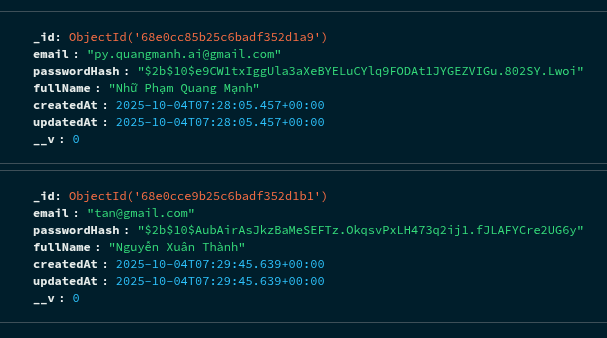

- `faces`:

    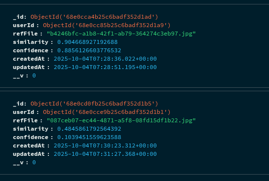

- Log trả ra ở terminal để quan sát.
  - Backend:

    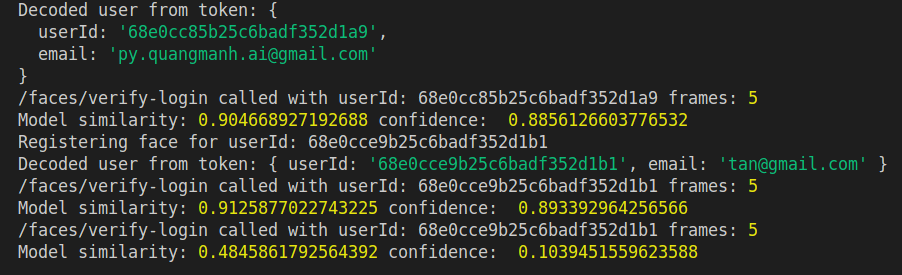
  - Model: 

    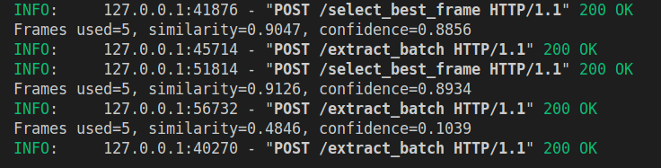