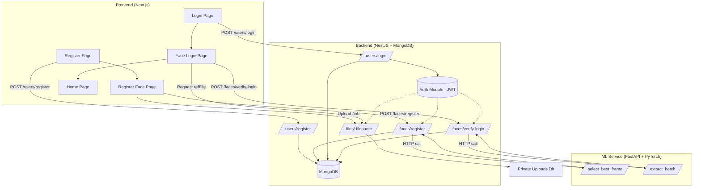

# README.md
# XAC_THUC – Face Authentication System

Hệ thống xác thực người dùng bằng **gương mặt**, xây dựng fullstack với:

- **Frontend**: Next.js (React, Tailwind CSS)  
- **Backend**: NestJS (Node.js, MongoDB)  
- **ML Service**: FastAPI (Python, PyTorch, FaceNet)

---

## Cấu trúc dự án

```text
XAC_THUC/
├── face-backend/           # NestJS backend
│   ├── src/
│   │   ├── faces/          # Face module (controller, schema, service)
│   │   ├── users/          # User module (controller, schema, service)
│   │   ├── app.module.ts   # Root module
│   │   ├── main.ts         # Entry point
│   │   └── multer.config.ts
│   ├── package.json
│   └── tsconfig.json
│
├── face-frontend/          # Next.js frontend
│   ├── app/
│   │   ├── home/page.tsx
│   │   ├── login/page.tsx
│   │   ├── register/page.tsx   # đăng kí gương mặt
│   │   └── face-login/page.tsx
│   ├── package.json
|   ├── page.tsx            # trang đăng kí
│   └── next.config.js
|   
│
├── face-ml/                # FastAPI ML service
│   ├── reg_model.py        # Main ML API (extract, verify)
│   ├── requirements.txt
│   └── .env.example
│
├── .gitignore
└── README.md
````

---

## Kiến trúc tổng thể



---

## Cài đặt & chạy

### 1. Backend (NestJS)

```bash
cd face-backend
npm install
echo "MONGO_URI=mongodb://localhost:27017/xac_t" > .env
npm run start:dev
# Server chạy ở http://localhost:3001
```

### 2. Frontend (Next.js)

```bash
cd face-frontend
npm install
npm run dev
# App chạy ở http://localhost:3000
```

### 3. ML Service (FastAPI + Python)

```bash
cd face-ml
python3 -m venv .venv
source .venv/bin/activate
pip install -r requirements.txt
echo "BASE_DIR=$(pwd)" > .env
echo "ML_PORT=9100" >> .env
python reg_model.py
# Server chạy ở http://localhost:9100
```

---

## Flow hoạt động

1. **Đăng ký tài khoản**

   * FE gọi `POST /users/register` → BE lưu user vào MongoDB → redirect sang đăng ký gương mặt.

2. **Đăng ký gương mặt**

   * FE chụp 10 frames → gửi `POST /faces/register`.
   * BE gọi ML `/select_best_frame`.
   * ML chọn frame tốt nhất → BE lưu `refFile` vào DB.

3. **Đăng nhập**

   * FE gửi email + password → `POST /users/login`.
   * Nếu đúng → trả `step: "face_required"` → redirect sang face-login.

4. **Xác thực gương mặt**

   * FE chụp 10 frames → gửi `POST /faces/verify-login`.
   * BE gọi ML `/extract_batch` → nhận similarity + confidence.
   * BE trả về `success` hoặc `fail`.

---

## Dependencies chính

* **Frontend**: Next.js, Tailwind CSS, Axios
* **Backend**: NestJS, Mongoose, Multer, Bcrypt
* **ML Service**: FastAPI, PyTorch, facenet-pytorch, OpenCV, Pillow

---

## Demo UI

* `/register` → Đăng ký tài khoản
* `/register?user_id=...` → Đăng ký gương mặt
* `/login` → Đăng nhập
* `/face-login?user_id=...` → Xác thực gương mặt
* `/home` → Trang chính sau khi đăng nhập thành công

---